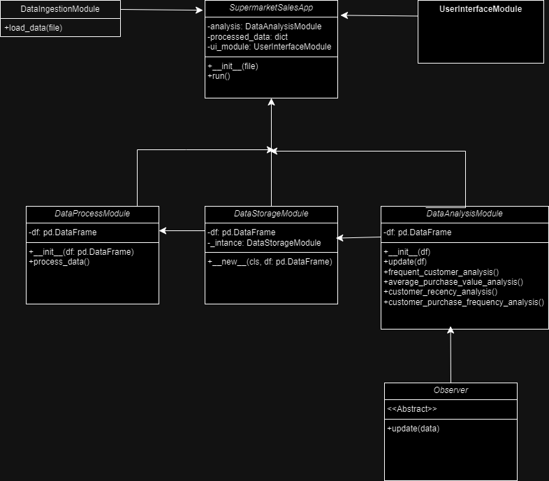

# Data‑Science‐Dashboard (Python)  
*A Data Analysis Application using Python*

## Table of Contents  
- [About](#about)  
- [Features](#features)  
- [Tech Stack & Dependencies](#tech‑stack‑dependencies)  
- [Getting Started](#getting‑started)  
  - [Prerequisites](#prerequisites)  
  - [Installation](#installation)  
  - [Running the Application](#running‑the‑application)  
- [Project Structure](#project‑structure)  
- [Usage & Screenshots](#usage‑screenshots)  
- [Testing](#testing)  
- [Design & Architecture](#design‑architecture)  
- [Contributing](#contributing)  
- [License](#license)  
- [Contact](#contact)  

## About  
This repository contains **Data‑Science‐Dashboard**, a Python‑based data analysis application designed to explore, analyse, and visualise sales data for a retail scenario. The application offers insights such as best‑selling products, customer behaviour, product performance, and regional sales trends.

## Features  
- Load and pre‑process sales data (e.g., `supermarket_sales.csv`, enhanced/expanded datasets)  
- Perform exploratory data analysis (EDA): product performance, customer segmentation, regional insights  
- Visualise key metrics with interactive dashboards  
- Modular architecture enabling extendibility (new features, visualisations)  
- Automated testing of analysis modules and user acceptance tests  

## Tech Stack & Dependencies  
- Python (>= 3.8)  
- Libraries: pandas, numpy, matplotlib / seaborn / plotly (depending on visualisation choice)  
- Batch files for automation: `Run Main Application.bat`, `run testing.bat`  
- Testing frameworks: `unittest` (or pytest if used)  
- Dataset files included: `supermarket_sales.csv`, `supermarket_sales_enhanced.csv`, `supermarket_sales_expanded.csv`  

## Getting Started  

### Prerequisites  
- Python installed on your system  
- (Optional) Virtual environment recommended  
- Basic familiarity with running Python scripts and batch files  

### Installation  
1. Clone the repository:  
   git clone https://github.com/mohamed-riham/Data-Science-Dashboard-python-.git
   cd Data-Science-Dashboard-python-

2. (Optional) Create & activate a virtual environment:  
   python -m venv venv
   source venv/bin/activate   # On Linux/Mac
   venv\Scripts\activate      # On Windows

3. Install dependencies:  
   pip install -r requirements.txt

### Running the Application  
- To run the main dashboard & analysis application:  
   python main.py

- To run the automated tests:  
   python test_analysis.py
   python user_acceptancy_test.py

## Project Structure  
/ (root)

  ├── main.py

  ├── supermarket_sales.csv

  ├── supermarket_sales_enhanced.csv

  ├── supermarket_sales_expanded.csv

  ├── test_analysis.py

  ├── user_acceptancy_test.py

  ├── LICENSE

  ├── README.md

  ├── Run Main Application.bat

  └── run testing.bat

## Usage & Screenshots  
Here are some views of the application dashboards and visualisations:

- **Class Diagram:**  
    

Here are some views of the application’s dashboards and visualisations (located in `docs`):  
- Screenshot 1: `docs/Screenshot (469).png`  
- Screenshot 2: `docs/Screenshot (470).png`  
- Screenshot 3: `docs/Screenshot (471).png`
- Screenshot 4: `docs/Screenshot (472).png`

## Testing  
Includes both unit and user acceptance tests.

## Design & Architecture  
Applies SOLID principles and design patterns (Singleton, Factory, Observer).

## Contributing  
Pull requests are welcome.

## License  
MIT License

## Contact  
Created by **Mohamed Riham**.
